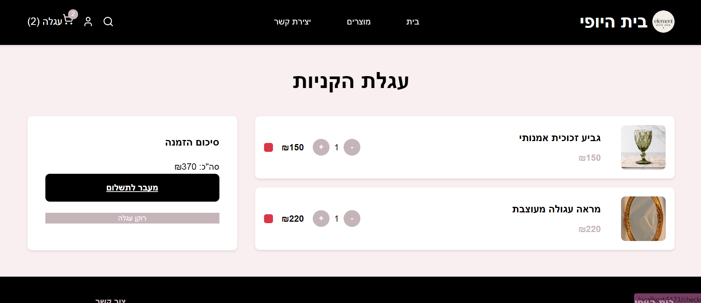
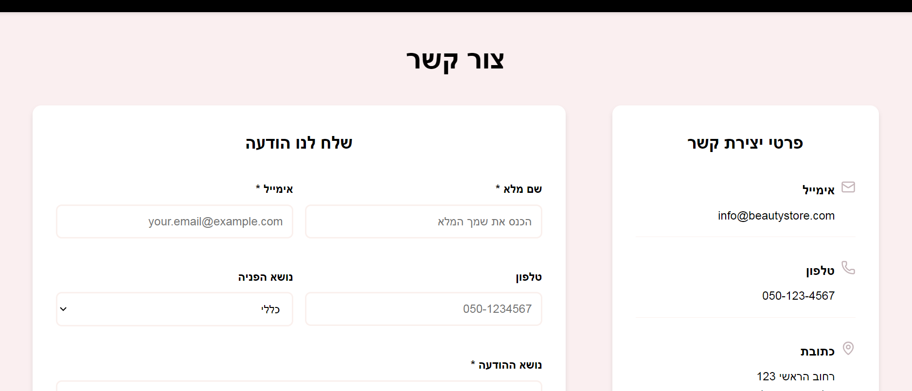

# 🏠 Beauty Store - חנות בית היופי

Full-stack e-commerce platform for home decoration and design products.


## 🌟 Live Demo
- **Repository**: [House of Beauty](https://github.com/ShiraHubashi/house-of-beauty)
- **Frontend**: Located in `/frontend` directory
- **Backend**: Located in `/backend` directory

## ✨ Key Features

### 🛍️ E-commerce Functionality
- **Product Catalog** with search and category filtering
- **Shopping Cart** with real-time quantity updates
- **Product Details** pages with image display
- **Checkout Flow** with form validation
- **Contact System** with backend integration

### 🎨 User Experience
- **RTL Support** for Hebrew language
- **Responsive Design** across all devices
- **Modern UI/UX** with clean aesthetics
- **Interactive Elements** with smooth transitions

## 📱 Screenshots

### Homepage with Featured Products


### Products Catalog with Filtering


### Product Detail Page


### Shopping Cart


### Contact Form


## 🛠️ Technical Stack

### Frontend Technologies
- **React 18** with modern Hooks
- **React Router DOM** for SPA navigation
- **Context API** for state management
- **Lucide React** for consistent iconography
- **CSS3** with RTL and responsive design

### Backend Technologies
- **Node.js + Express** RESTful API
- **MongoDB + Mongoose** for data persistence
- **JWT Authentication** for security
- **Bcrypt** for password hashing
- **Joi Validation** for data integrity

## 🚀 Architecture Highlights

- **Full-Stack Development** with separate frontend/backend
- **RESTful API Design** with proper HTTP methods
- **Component-Based Architecture** for reusability
- **State Management** with React Context
- **Database Modeling** with Mongoose schemas
- **Security Best Practices** with CORS, validation, and hashing

## 🎯 Development Features

### Code Quality
- **Modern JavaScript** (ES6+)
- **React Best Practices** (Hooks, Context, Components)
- **Clean Code Structure** with organized folders
- **Git Version Control** with meaningful commits

### User Experience
- **Hebrew RTL Support** throughout the application
- **Loading States** for better UX
- **Error Handling** with user-friendly messages
- **Form Validation** on client and server side

## 📊 Project Scope

This project demonstrates expertise in:
- **Frontend Development** with React ecosystem
- **Backend Development** with Node.js and Express
- **Database Design** and management
- **API Development** and integration
- **UI/UX Design** with attention to detail
- **Full-Stack Integration** between all layers

## 🔧 Quick Start

```bash
# Clone the repository
git clone https://github.com/ShiraHubashi/house-of-beauty.git
cd house-of-beauty

# Backend Setup
cd backend
npm install
npm run seed
npm run dev

# Frontend Setup (in a new terminal)
cd frontend
npm install
npm run dev
